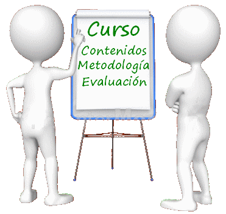

# 10. Tu evaluación y la nuestra

## TU EVALUACIÓN

Al finalizar el curso te enviaremos los resultados del cuestionario que envían tus alumnos de tu tutorización. [Aquí tienes un PDF para que veas qué le preguntamos](https://drive.google.com/file/d/1tgvbSeA-lTf3EWNcVWDHQAgidkcKxboF/view?usp=sharing). Estos resultados no se publican, te daremos una copia a ti de los datos correspondientes a tu curso para que juntos evaluemos y lo mejoremos.

## NUESTRA EVALUACIÓN

Finalmente te propondremos que nos aportes [sugerencias](http://soporte.catedu.es/) que nos ayuden a mejorar en:

Los resultados públicos de la evaluación que hacen los alumnos de los cursos de Aularagon los puedes ver [aquí](https://docs.google.com/document/d/1HJYkPRoAlf11qOmw3ukqzQ0d526Jz4ytkZFN8gcli2s/edit?usp=sharing).
