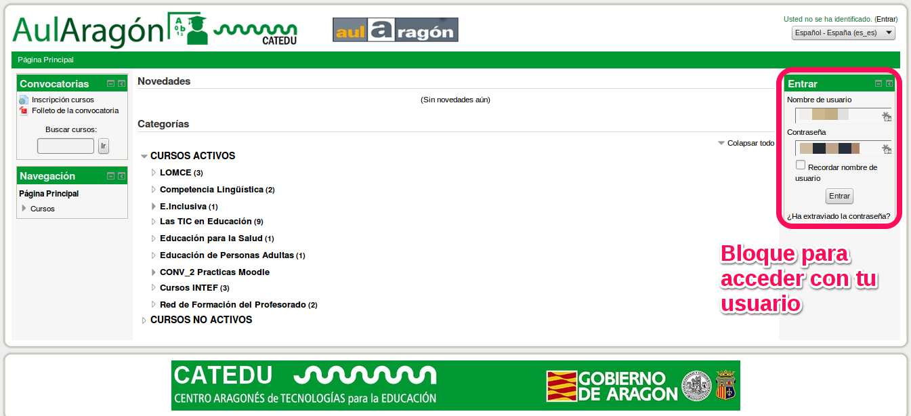

# 2.1. Entrar en la plataforma

Si insertamos correctamente nuestro usuario y contraseña, sale arriba a la derecha **Usted se ha identificado como ...** y nos aparecerá una pantalla donde entraremos en Mis cursos.

Si entramos en Mis cursos aparece la relación de cursos a los que tenemos acceso:

Una vez dentro del curso, identificamos estos elementos:

* Mensajes pendientes: contestar lo antes posible a los alumnos.

* El curso está dividido en MÓDULOS. Cada módulo tiene:

    * Contenidos del curso: Los alumnos tienen acceso a todos los contenidos on-line y a los materiales descargables.

    * Tareas: Descripción de las tareas obligatorias a entregar en cada módulo.

Menús: Son contextuales. ¿Qué quiere decir eso? Que dependiendo de dónde estemos y del perfil con el que accedamos (alumno o profesor) cambian su contenido.

