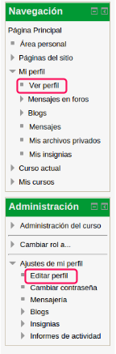
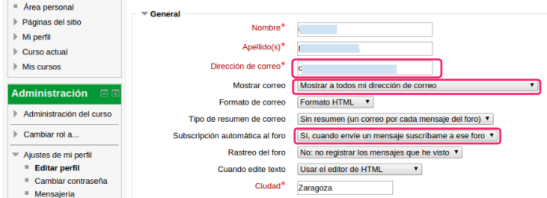
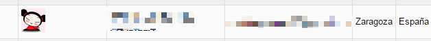

# 2. Mi perfil

Es conveniente editar nuestras preferencias como tutor. Para poder consultar los datos sobre nuestro perfil, entramos en el Menú de navegación en Mi perfil - Ver perfil. 

Pero si lo que queremos es modificar alguno de los valores, lo haremos desde el Menú de administración entramos en Editar perfil.

Desde Editar perfil,  podemos decidir si nuestros alumnos** pueden ver nuestro email** (no recomendable, es preferible que toda comunicación se haga dentro de la plataforma), que llegue un** aviso a nuestro email** cuando alguien escribe en el foro (recomendable), etc..

 

Más abajo podemos incluir una imagen que se visualizará en forma de icono al lado de nuestro nombre. Es muy recomendable añadir **una foto** o un **avatar** que te represente. Ayuda a establecer una relación más cercana con tus alumnos. 

 
