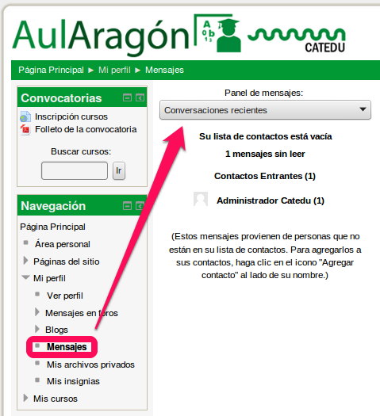
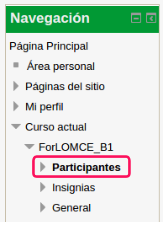
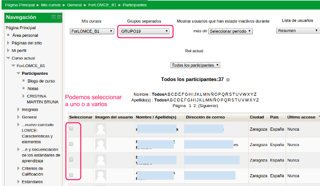
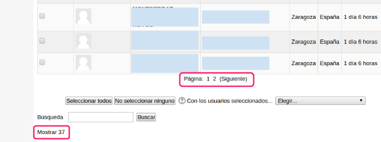
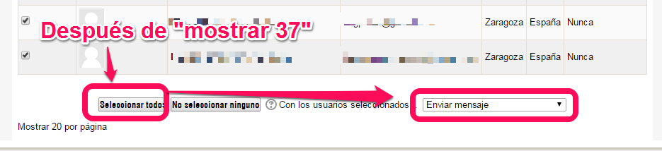

#2.3. Mensajería

##2.3.1.-Contestar mensajes

La mensajería está diseñada para dialogar en formato chat, no admite formato de texto (negrita, cursiva, etc).

No soporta el envío de adjuntos, para lo cual excepcionalmente se pueden utilizar otras técnicas ([Dropbox](http://www.catedu.es/facilytic/2013/05/16/dropbox/) ,[ Drive](http://www.catedu.es/facilytic/2013/05/30/manual-google-drive/)..).

Cuando se entra en la mensajería, aparecen las conversaciones pendientes de leer. Pero para visualizar todas las conversaciones que hayas iniciado con tus alumnos, hay que seleccionar Conversaciones recientes o todas.

##2.3.2.- Enviar un mensaje de forma masiva

A veces interesa enviar a todos los alumnos de tu curso un mismo mensaje, por ejemplo un mensaje de bienvenida al curso. Para ello, entramos en el menú de navegación en Curso actual - &lt;título del curso&gt; - Participantes

En principio aparece un listado con los alumnos de nuestro curso (en este ejemplo ForLOMCE_B1). En el caso que nuestro curso tenga varios grupos separados de alumnos, podemos seleccionar para que nos muestre sólo los de nuestro grupo (GRUPO19 en el ejemplo). De la relación de todos los participantes de nuestro grupo, podemos seleccionar uno o varios de ellos para enviarles un mensaje.

Para enviar un mensaje a todos los alumnos de nuestro grupo, nos fijaremos en las opciones que aparecen debajo del listado:

El listado mostrará páginas de 20 alumnos, pero si en nuestro grupo hay más, podemos hacer que se muestren todos pulsando Mostrar N (37 en el caso del ejemplo, o el número de alumnos que tenga tu grupo).

Después, también abajo, solo hay que clicar al botón Seleccionar a todos y luego en Con los usuarios seleccionados - Elegir -  Enviar mensaje. 

