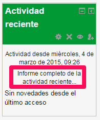
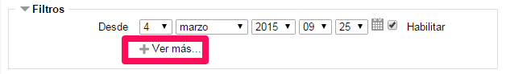
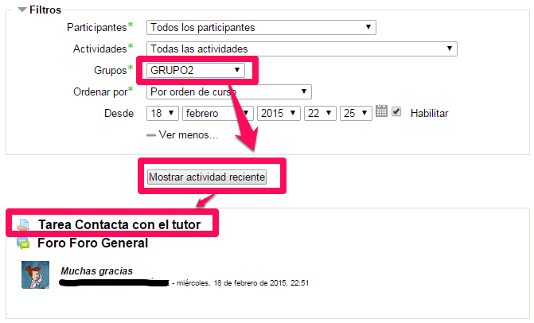
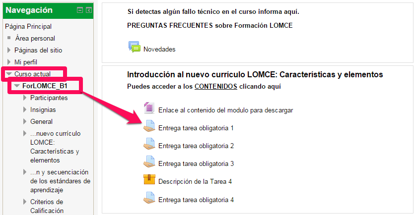
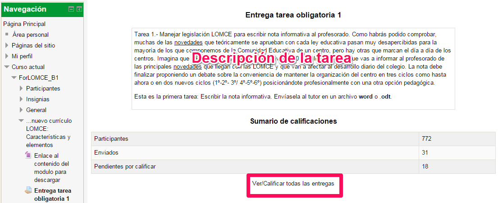

# 4.1. Dónde están las entregas

# **Opción A) Actividad reciente**

Para ver las entregas que nuestros alumnos hayan realizado desde la última vez que entramos en la plataforma, podemos hacer clic en Informe completo de la actividad reciente…  que se encuentra en la columna derecha.

En la página que aparece, le damos a + Ver más...

Seleccionamos nuestro grupo para sólo ver la actividad reciente de nuestros alumnos, y hacemos clic en la Tarea que queramos evaluar:

## **Opción B) Tareas**

También podemos entrar en una Tarea directamente desde la página del curso:

A continuación, entramos en Ver/Calificar todas las entregas

y realizamos los siguientes pasos:

* Elegimos nuestro grupo (sólo en el caso que nuestro curso tenga varios grupos).

* Filtramos por Requiere calificación (esto facilitará que sólo se muestren las entregas que tengamos pendientes de calificar).

* Si marcamos la opción Calificación rápida, podremos calificar como Apto o No Apto directamente en la lista de tareas. Esta opción NO la recomendamos. Como ya vimos en el anterior módulo, recomendamos COMENTAR las entregas.