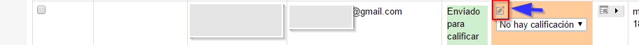
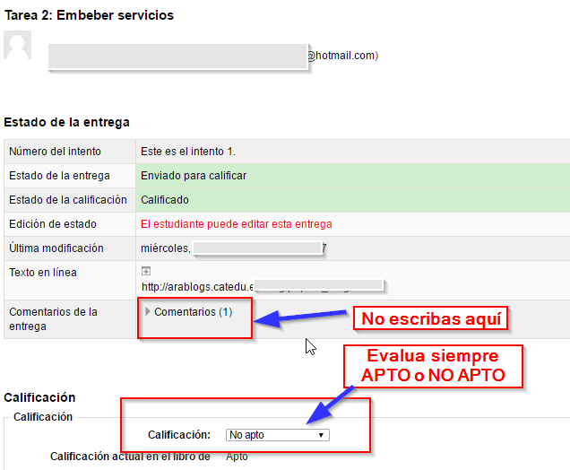
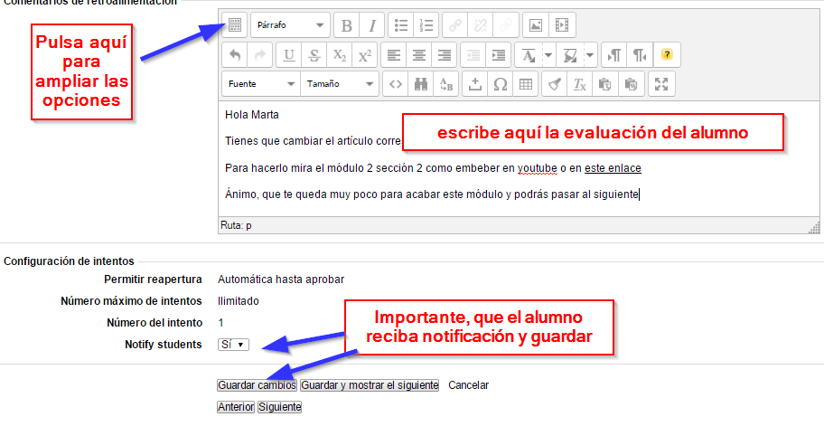

# 4.2. Evaluar las entregas

Nuestra tarea más importante

Una vez localizada la tarea, corregimos la entrega:

Evaluamos: clic en el botón del lápiz  para abrir la Página de evaluación

y en la página de evaluación descargamos el fichero de la entrega si procede, la evaluamos y **RETROALIMENTAMOS** es decir, comentamos la entrega:

* Si es **APTO** le felicitamos, y le decimos que ya puede pasar al módulo siguiente y evaluamos APTO.
* si es **NO APTO** comentamos **bien claro lo que tiene que corregir para superar el módulo** junto con alguna frase de ánimo Y EVALUAMOS NO APTO para que quede bien claro que el módulo no está superado:

En la retroalimentación puedes embeber vídeos, enlaces, añadir ficheros... para ayudar al alumno dónde encontrar la solución, lo mejor es referenciarlo en los contenidos, y si no está en los contenidos, es mejor cambiar los contenidos que volver a explicar lo mismo una y otra vez, ponte en contacto con nosotros si no sabes cómo mejorar los contenidos.

