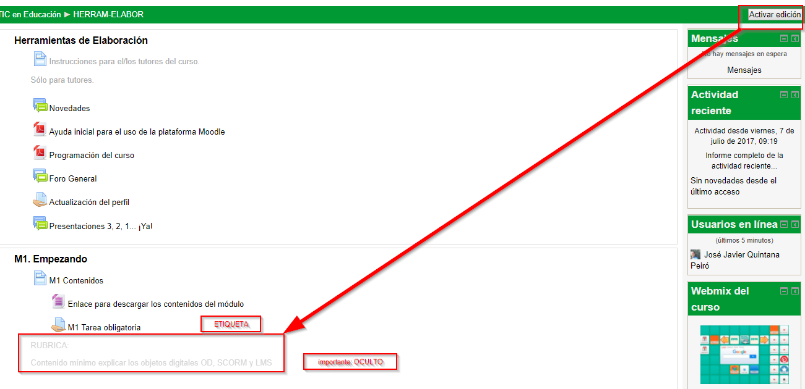

# 6. Rúbricas

# AYUDAS PARA LA CORRECCIÓN

Puedes añadir las instrucciones, mejoras, las **soluciones** de las actividades, enlaces a enviar de forma privada a los alumnos, consejos… (es decir todo aquello que puede servir** para el tutor pero no lo tienen que ver los alumnos**) para tu curso concreto y módulo concreto, pensando en el provecho de los siguientes TUTORES de tu curso o cuando tú vuelvas a tutorizarlo.

**¿DONDE?** En el mismo curso, puedes encontrar alguna **ETIQUETA oculta** que tú SI puedes ver y los alumnos NO

Puedes añadir etiquetas, modificar las existentes, pinchando en Activar edición, para mejorarlos

