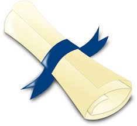

# 3.8. Certificados

## Tu certificado como tutor

 * **Tu certificado de tutorización oficial** se enviará a la dirección postal que tengamos de nuestros registros (cuando solicitastes entrar en la lista) o en caso de omisión la que indiques en la nominilla.
 * También a comienzos del año natural siguiente recibirás un certificado en la misma dirección de la retención IRPF aplicada.
 * En muchas baremaciones tiene el mismo peso que ponencia. 
 * Tu certificado llevará el número GIFP (Gestión Integral Formación del Profesorado) siempre que seas docente.

## Los certificados de los ALUMNOS que han aprobado

Desde CATEDU se intenta que en un plazo no superior a 2 meses desde que finalizó el curso, se envíen por correo postal los certificados. Pero por cuestiones ajenas, ese plazo se alarga.

* No obstante todos los cursos de CATEDU a los pocos días de su finalización** ESTÁN REGISTRADOS EN EL NGIFP y en el PADOC** automáticamente por lo tanto NO ES NECESARIO el título en papel para justificar baremos dentro del Departamento de Educación del Gobierno de Aragón.
* **La dirección de envío**: será la que rellenaste en el formulario de inscripción al curso de Aularagón.
* **Son válidos dos o más cursos online coincidentes en el tiempo con CATEDU** [ver](http://soporte.catedu.es/kb/faq.php?id=2).
* Todos nuestros certificados **son oficiales**.
* **Bajo ningún concepto emitimos otro tipo de resguardos o certificados provisionales** que no sea el oficial.

**Puedes utilizar este texto como complemento al mensaje final que envíes a los alumnos que han acabado y superado tu curso**.

