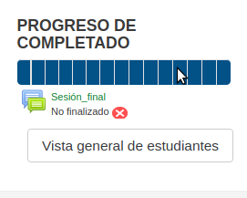
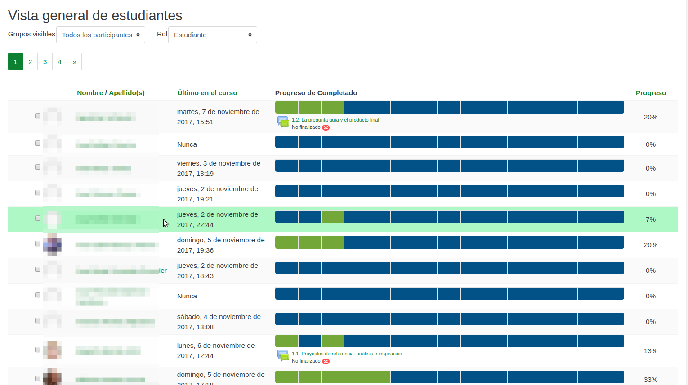

# Barra de Progreso de Completado e insignias.

El moodle incorpora una barra de "Progreso de Completado" que permite a los alumnos saber como están avanzando en el curso.

Cada rectángulo representa una actividad obligatoria. Esos rectángulos van cambiando a color verde conforme el tutor evalúa como "Apto" las actividades permitiendo al alumno tener información sobre sus avances.

Esta boque de progreso es también una herramienta del tutor para la evaluación final, puesto que el tutor puede entrar en la "Vista general de estudiantes:

Esta vista permite hacer un seguimiento del avance de los alumnos en el curso y facilita enormemente la evaluación inicial.

Para constar como APTO en la evaluación final, un estudiante tiene que haber superado (color verde)  **todas las actividades obligatorias específicas del curso. **Sin embargo**, **Un alumno **puede constar como APTO en la evaluación final pese a no tener verdes las actividades obligatorias comunes a todos los cursos que son:**

1. Actualiza tu perfil
1. Presentaciones 3, 2, 1...Ya!
1. Créditos
1. Valoración del curso.

Un alumno que hiciera eso, constaría como APTO y recibiría el certificado **pero no recibiría la Insignia asociada en el Moodle**.

Esta vista general es muy útil para repasar la evaluación de las actividades azules de los alumnos no APTOS, puesto que podemos acceder a la entrega de un alumno en una actividad pulsando sobre el rectángulo azul correspondiente.
