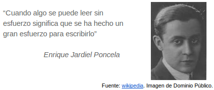

# 1. Que no te falte estilo...

 A diferencia de lo que decimos, lo que escribimos permanece. Y si además lo publicamos en internet, tiene una gran difusión. Ésta peculiaridad condiciona enormemente la docencia on-line en la que, probablemente, vas a dar tus primeros pasos.

Si queremos mantener una buena comunicación con nuestros alumnos debemos cuidar cada mensaje, cada comentario de evaluación y cada post en los foros. 

 
